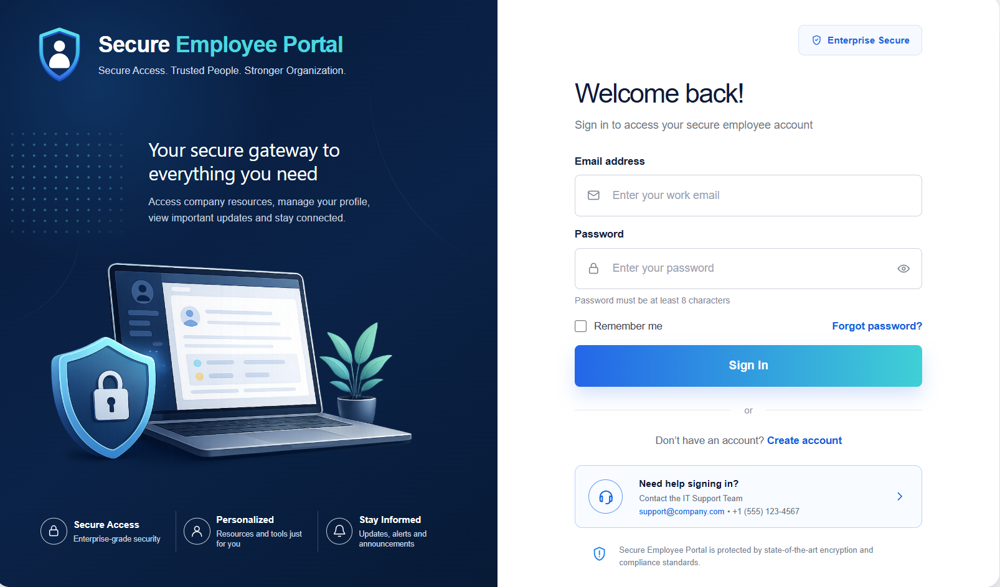
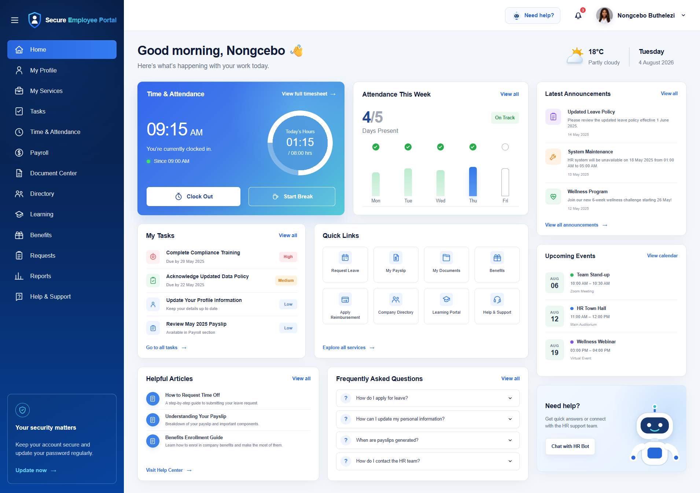

<!-- Secure Employee Portal README -->

# Secure Employee Portal

A secure employee self-service and access-management portal built with Blazor and .NET.

<!-- Technology and project-status badges -->

<!-- Main project screenshot -->

## Project Overview

The Secure Employee Portal is a business-focused application designed to demonstrate secure employee authentication, protected account access, role-based experiences, and employee self-service workflows.

The project is being developed as part of a professional .NET full-stack software engineering portfolio.

<!-- Current employee-dashboard interface -->

## Current Interface

### Employee Dashboard

The employee dashboard provides a protected self-service workspace with attendance, tasks, quick links, announcements, upcoming events, help resources, and account-security reminders.

## Current Status

**In progress**

The current version includes the visual foundation for:

- Login
- Registration
- Forgot password
- Reset password
- Password reset confirmation
- Employee dashboard

Backend authentication, database persistence, role-based authorisation, and account-management functionality are planned next.

## Technology Stack

- C#
- .NET
- Blazor
- ASP.NET Core
- Razor components
- CSS

Planned additions:

- Entity Framework Core
- SQL
- ASP.NET Core Identity
- Role-based authorisation
- Testing
- Deployment

## Planned Core Features

- User registration
- Secure login and logout
- Password reset
- Protected employee dashboard
- Employee profile management
- Role-based access
- Administrator user management
- Account activation and suspension
- Security events
- Audit logging

## Project Purpose

This project demonstrates the development of a secure, professional business application with a focus on:

- Authentication
- Authorisation
- Account security
- Protected workflows
- Business rules
- Full-stack application architecture

## Development Status

This repository is under active development. Features and documentation will be updated as the application progresses.